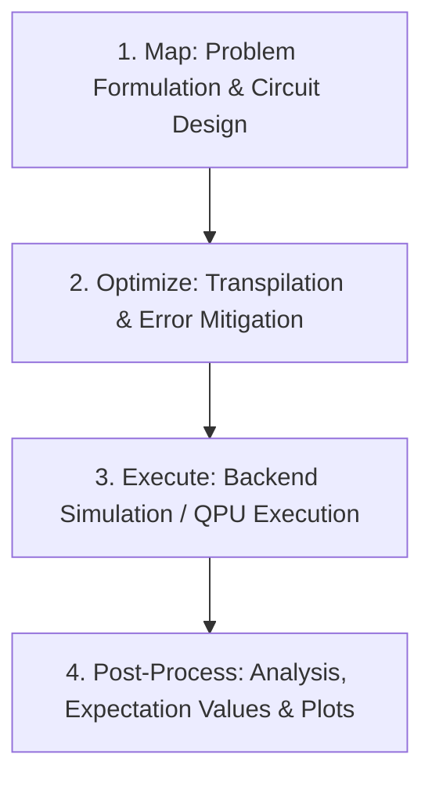

# Module 1: Getting Started with Qiskit

**Course:** Physics SOP on *ME-QST-NISQ-era Computation*  
**Institution:** Birla Institute of Technology and Science (BITS), Pilani – K.K. Birla Goa Campus  
**Module:** Getting Started with Qiskit  
**Source Resource:** [IBM Quantum Learning – Getting Started with Qiskit](https://quantum.cloud.ibm.com/learning/en/modules/quantum-mechanics/get-started-with-qiskit)

---

## Overview

This module establishes the foundational principles of quantum information processing by systematically contrasting classical computation with quantum computing. Beginning with basic bitwise logic, we transition to quantum states, single- and multi-qubit gates, superposition, quantum phase, entanglement, and measurement. 

The practical component culminates in the design, implementation, and simulation of a **Reversible Quantum Half-Adder** using Qiskit. We also explore quantum parallelism by evaluating the half-adder across a full superposition of inputs and verify the decomposition of the three-qubit Toffoli gate into universal single- and two-qubit gate primitives.

---

## Key Concepts

### Classical Computing

Classical computation is built upon deterministic manipulation of binary information:

- **Bits and Binary Representation:**
  A classical bit is a physical system with two distinct states: $0$ and $1$. An $N$-bit register represents an unsigned integer using positional notation:
  $$(b_{n-1} b_{n-2} \dots b_1 b_0)_2 = \sum_{k=0}^{n-1} b_k 2^k \quad \text{where } b_k \in \{0, 1\}$$
  An $N$-bit classical register exists in exactly **one** of the $2^N$ possible configurations at any given instant.

- **Classical Logic Gates:**
  Standard classical gates manipulate bits according to Boolean logic:
  - **NOT ($\neg$):** Inverts the bit ($0 \mapsto 1, 1 \mapsto 0$).
  - **AND ($\wedge$):** Outputs $1$ if and only if both inputs are $1$ ($A \cdot B$).
  - **OR ($\vee$):** Outputs $1$ if at least one input is $1$ ($A + B$).
  - **XOR ($\oplus$):** Outputs $1$ if exactly one input is $1$ ($A \oplus B = A\bar{B} + \bar{A}B$).
  
  Most classical logic gates (like AND, OR, XOR) are **irreversible**—information is lost during computation because 2 input bits are mapped to 1 output bit.

- **The Half-Adder Circuit:**
  A half-adder calculates the sum of two single-bit binary inputs $A$ and $B$:
  $$\text{Sum } S = A \oplus B$$
  $$\text{Carry } C = A \cdot B$$
  
  | $A$ | $B$ | Carry ($C$) | Sum ($S$) | Binary Output ($CS$) | Decimal Sum |
  |:---:|:---:|:-----------:|:---------:|:--------------------:|:-----------:|
  |  0  |  0  |      0      |     0     |          00          |      0      |
  |  0  |  1  |      0      |     1     |          01          |      1      |
  |  1  |  0  |      0      |     1     |          01          |      1      |
  |  1  |  1  |      1      |     0     |          10          |      2      |

---

### Quantum Computing

Quantum information extends classical states into complex vector spaces (Hilbert spaces), introducing superposition, relative phase, and entanglement.

- **Qubits (Quantum Bits):**
  A qubit is a two-level quantum system described by a state vector $|\psi\rangle$ in a two-dimensional complex Hilbert space $\mathbb{C}^2$, spanned by the orthonormal computational basis states:
  $$|0\rangle = \begin{pmatrix} 1 \\ 0 \end{pmatrix}, \quad |1\rangle = \begin{pmatrix} 0 \\ 1 \end{pmatrix}$$
  
  A general pure state is a linear superposition:
  $$|\psi\rangle = c_0 |0\rangle + c_1 |1\rangle = \begin{pmatrix} c_0 \\ c_1 \end{pmatrix}, \quad c_0, c_1 \in \mathbb{C}$$
  
  The state must be normalized to unity:
  $$\langle\psi|\psi\rangle = |c_0|^2 + |c_1|^2 = 1$$

- **Bloch Sphere & Quantum Phase:**
  Ignoring physically unobservable global phase, any single-qubit pure state can be parameterized on the unit **Bloch sphere**:
  $$|\psi\rangle = \cos\left(\frac{\theta}{2}\right)|0\rangle + e^{i\phi}\sin\left(\frac{\theta}{2}\right)|1\rangle$$
  where $\theta \in [0, \pi]$ is the polar angle and $\phi \in [0, 2\pi)$ is the azimuthal (relative) phase.
  
  While a **global phase** ($e^{i\gamma}|\psi\rangle$) has no measurable physical consequence ($\left|e^{i\gamma}c_k\right|^2 = |c_k|^2$), the **relative phase** ($\phi = \phi_1 - \phi_0$) drives quantum interference and dictates how states transform under subsequent operations (e.g., $H|+\rangle = |0\rangle$ vs $H|-\rangle = |1\rangle$).

- **Multiple Qubits & State Space Growth:**
  The state space of an $N$-qubit system is the tensor product of individual qubit spaces:
  $$\mathcal{H} = \mathcal{H}_1 \otimes \mathcal{H}_2 \otimes \dots \otimes \mathcal{H}_N \cong \mathbb{C}^{2^N}$$
  
  An $N$-qubit state is represented as:
  $$|\psi\rangle = \sum_{x=0}^{2^N-1} c_x |x\rangle, \quad \sum_{x=0}^{2^N-1} |c_x|^2 = 1$$
  where $|x\rangle = |q_{N-1} q_{N-2} \dots q_0\rangle$ represents the $N$-bit binary string for integer $x$. The dimensionality grows exponentially ($2^N$), allowing $N$ qubits to simultaneously hold a superposition of $2^N$ classical states.

- **Little-Endian Notation in Qiskit:**
  Qiskit adheres strictly to **little-endian ordering**:
  - The qubit with index $0$ ($q_0$) is the **Least Significant Qubit (LSQ)** and is positioned at the **rightmost** end of the bitstring.
  - The qubit with index $N-1$ ($q_{N-1}$) is the **Most Significant Qubit (MSQ)** and is positioned at the **leftmost** end.
  
  $$\text{Bitstring: } |q_{N-1} q_{N-2} \dots q_1 q_0\rangle \iff \text{Integer value: } \sum_{j=0}^{N-1} q_j 2^j$$
  
  *Example:* If $q_0 = 1, q_1 = 0, q_2 = 0$, the state is written as $|001\rangle$ (representing decimal 1), not $|100\rangle$.

- **Quantum Entanglement:**
  A multi-qubit state $|\psi\rangle \in \mathcal{H}_A \otimes \mathcal{H}_B$ is **entangled** if it cannot be factored into product states of its individual subsystems:
  $$|\psi\rangle \neq |\psi_A\rangle \otimes |\psi_B\rangle$$
  
  The canonical example is the maximally entangled Bell state $|\Phi^+\rangle$:
  $$|\Phi^+\rangle = \frac{1}{\sqrt{2}}(|00\rangle + |11\rangle)$$
  
  Measuring the first qubit yielding $|0\rangle$ instantaneously projects the second qubit into $|0\rangle$, regardless of spatial separation, exhibiting non-local quantum correlations that violate Bell inequalities.

- **Linear Algebra & Unitary Operations:**
  Quantum states are unit vectors, and all closed quantum operations are described by **unitary operators** $U$:
  $$U^\dagger U = U U^\dagger = I$$
  Unitary operators preserve the inner product ($\langle U\psi | U\phi \rangle = \langle \psi | \phi \rangle$) and are strictly **reversible** ($U^{-1} = U^\dagger$).

---

### Quantum Gates

Quantum logic gates are unitary transformations acting on qubits. Below are the core gates used throughout this module:

#### 1. Pauli-X Gate (NOT Gate)
Performs a $\pi$-rotation around the $X$-axis of the Bloch sphere, flipping computational basis states:
$$X = \begin{pmatrix} 0 & 1 \\ 1 & 0 \end{pmatrix}$$
$$X|0\rangle = |1\rangle, \quad X|1\rangle = |0\rangle$$

#### 2. Hadamard Gate ($H$)
Creates an equal superposition state by rotating the basis from $Z$ to $X$:
$$H = \frac{1}{\sqrt{2}}\begin{pmatrix} 1 & 1 \\ 1 & -1 \end{pmatrix}$$
$$H|0\rangle = |+\rangle = \frac{|0\rangle + |1\rangle}{\sqrt{2}}, \quad H|1\rangle = |-\rangle = \frac{|0\rangle - |1\rangle}{\sqrt{2}}$$

#### 3. Pauli-Z Gate (Phase Flip)
Applies a relative phase shift of $\pi$ ($e^{i\pi} = -1$) to the $|1\rangle$ component:
$$Z = \begin{pmatrix} 1 & 0 \\ 0 & -1 \end{pmatrix}$$
$$Z|0\rangle = |0\rangle, \quad Z|1\rangle = -|1\rangle$$

#### 4. T Gate ($\pi/8$ Gate / $\pi/4$ Phase Gate)
Applies a relative phase of $\pi/4$ ($e^{i\pi/4}$):
$$T = \begin{pmatrix} 1 & 0 \\ 0 & e^{i\pi/4} \end{pmatrix}, \quad T^\dagger = \begin{pmatrix} 1 & 0 \\ 0 & e^{-i\pi/4} \end{pmatrix}$$
$$T^2 = S = \begin{pmatrix} 1 & 0 \\ 0 & i \end{pmatrix}, \quad T^4 = Z$$
The $T$ gate is non-Clifford and essential for achieving universal quantum computation.

#### 5. Controlled-NOT Gate (CNOT / CX)
A 2-qubit entangling gate. Flips the target qubit $t$ if and only if the control qubit $c$ is $|1\rangle$:
$$CX = \begin{pmatrix} 1 & 0 & 0 & 0 \\ 0 & 1 & 0 & 0 \\ 0 & 0 & 0 & 1 \\ 0 & 0 & 1 & 0 \end{pmatrix}$$
$$CX|c, t\rangle = |c, t \oplus c\rangle$$
When the target qubit is initialized to $|0\rangle$, CNOT computes the classical XOR operation: $CX|A, 0\rangle = |A, A\rangle$.

#### 6. SWAP Gate
Exchanges the quantum states of two qubits:
$$SWAP = \begin{pmatrix} 1 & 0 & 0 & 0 \\ 0 & 0 & 1 & 0 \\ 0 & 1 & 0 & 0 \\ 0 & 0 & 0 & 1 \end{pmatrix}$$
$$SWAP|a, b\rangle = |b, a\rangle$$
The SWAP gate can be decomposed into 3 alternating CNOT gates:
$$SWAP(q_0, q_1) = CX(q_0, q_1) \cdot CX(q_1, q_0) \cdot CX(q_0, q_1)$$

#### 7. Toffoli Gate (CCX / Controlled-Controlled-NOT)
A 3-qubit gate with two control qubits and one target qubit. Flips the target qubit $t$ if and only if both control qubits $c_1, c_2$ are $|1\rangle$:
$$CCX = \begin{pmatrix} 
1 & 0 & 0 & 0 & 0 & 0 & 0 & 0 \\
0 & 1 & 0 & 0 & 0 & 0 & 0 & 0 \\
0 & 0 & 1 & 0 & 0 & 0 & 0 & 0 \\
0 & 0 & 0 & 1 & 0 & 0 & 0 & 0 \\
0 & 0 & 0 & 0 & 1 & 0 & 0 & 0 \\
0 & 0 & 0 & 0 & 0 & 1 & 0 & 0 \\
0 & 0 & 0 & 0 & 0 & 0 & 0 & 1 \\
0 & 0 & 0 & 0 & 0 & 0 & 1 & 0 
\end{pmatrix}$$
$$CCX|c_1, c_2, t\rangle = |c_1, c_2, t \oplus (c_1 \cdot c_2)\rangle$$
When target $t$ is initialized to $|0\rangle$, Toffoli computes the reversible Boolean AND operation: $CCX|A, B, 0\rangle = |A, B, A \cdot B\rangle$.

---

### Measurements

Measurement bridges the quantum and classical domains:

1. **Projective Measurement (von Neumann):**
   Measuring a qubit in the computational basis $\{|0\rangle, |1\rangle\}$ projects the state onto one of the measurement operators $M_0 = |0\rangle\langle0|$ or $M_1 = |1\rangle\langle1|$.
   
2. **Born's Rule:**
   For a state $|\psi\rangle = \sum_i c_i |i\rangle$, the probability $P(i)$ of observing basis state $|i\rangle$ is:
   $$P(i) = |\langle i | \psi \rangle|^2 = |c_i|^2$$

3. **Wavefunction Collapse:**
   Upon measurement, the superposition state non-unitarily and instantaneously collapses to the measured eigenstate:
   $$|\psi\rangle \xrightarrow{\text{Measurement yields } k} |k\rangle$$

4. **Destructive & Irreversible Nature:**
   Measurement is non-unitary and irreversible. It destroys all phase coherence and superposition amplitudes, leaving only a classical bit in the readout register.

---

### Qiskit Patterns Workflow

Modern quantum application development in Qiskit follows a standardized 4-step workflow:



1. **Map:** Define the physical/mathematical problem using quantum circuits (`QuantumCircuit`), quantum registers, and operators (`SparsePauliOp`).
2. **Optimize:** Transpile circuits using pass managers (`generate_preset_pass_manager` or `transpile`) to adapt the abstract circuit to target hardware basis gates, device topology/coupling maps, and reduce gate depth.
3. **Execute:** Run the transpiled circuits using execution primitives (`SamplerV2`, `EstimatorV2`) on physical quantum processors or local high-performance simulators (`AerSimulator`).
4. **Post-Process:** Retrieve bitstring counts, compute expectation values, apply readout error mitigation, and generate visualization plots (e.g., histograms via `plot_histogram`).

---

## Code Scripts

The following scripts are organized in the `Assignment_1/` directory:

- [`01_basic_gates.py`](file:///Users/adithyasmac/Documents/Study_material/4th%20Year/Phy_SOP/Assignment_1/01_basic_gates.py):
  Demonstrates fundamental single-qubit gates ($X, H, Z, T$) and multi-qubit operations ($CX, SWAP, CCX$). Outputs statevectors, circuit diagrams, and probability distributions using `AerSimulator`.

- [`02_half_adder.py`](file:///Users/adithyasmac/Documents/Study_material/4th%20Year/Phy_SOP/Assignment_1/02_half_adder.py):
  Implements a 4-qubit reversible quantum half-adder circuit using CNOT (for Sum / XOR) and Toffoli (for Carry / AND). Systematically verifies all four classical input combinations ($00, 01, 10, 11$).

- [`03_challenge_superposition.py`](file:///Users/adithyasmac/Documents/Study_material/4th%20Year/Phy_SOP/Assignment_1/03_challenge_superposition.py):
  Prepares input qubits $A$ and $B$ in an equal superposition state $\frac{1}{2}(|00\rangle + |01\rangle + |10\rangle + |11\rangle)$ using Hadamard gates. Executes the half-adder to compute all 4 arithmetic additions concurrently in a single quantum execution, illustrating quantum parallelism.

- [`04_challenge_toffoli.py`](file:///Users/adithyasmac/Documents/Study_material/4th%20Year/Phy_SOP/Assignment_1/04_challenge_toffoli.py):
  Decomposes the 3-qubit Toffoli (CCX) gate into an equivalent network of 6 CNOT gates and single-qubit $H, T, T^\dagger$ gates. Analytically and computationally validates the decomposition by multiplying unitary matrices and proving equivalence to the standard Toffoli matrix.

---

## Questions & Answers

### True/False Questions

1. **A single bit in a classical computer can only hold the value 0 or 1.**  
   $$\rightarrow \mathbf{True}$$  
   *Explanation:* A classical bit is fundamentally a binary physical switch (e.g., high/low voltage in a transistor) and can only occupy one of two discrete states: $0$ or $1$.

2. **Entanglement means the state of one qubit is independent of the state of another.**  
   $$\rightarrow \mathbf{False}$$  
   *Explanation:* Entanglement represents maximum quantum correlation. In an entangled state such as $|\Phi^+\rangle = \frac{1}{\sqrt{2}}(|00\rangle + |11\rangle)$, the individual state of either qubit cannot be described independently of the other. Measuring one qubit instantaneously determines the state of the other.

3. **Quantum gates are generally irreversible operations.**  
   $$\rightarrow \mathbf{False}$$  
   *Explanation:* Quantum gates acting on closed systems are represented by unitary operators ($U^\dagger U = I$), which are inherently linear, norm-preserving, and strictly reversible ($U^{-1} = U^\dagger$). The only irreversible operations in quantum circuits are measurements and dissipative decoherence processes.

4. **The Qiskit convention places the least significant qubit, $q_0$, at the leftmost position.**  
   $$\rightarrow \mathbf{False}$$  
   *Explanation:* Qiskit uses **little-endian** notation: $q_0$ (the least significant qubit) is placed at the **rightmost** position of the bitstring ($|q_{N-1} \dots q_1 q_0\rangle$).

5. **Measuring a quantum state always gives the exact same result if repeated many times.**  
   $$\rightarrow \mathbf{False}$$  
   *Explanation:* Quantum measurement is fundamentally probabilistic (governed by the Born rule $P(i) = |c_i|^2$). Repeated state preparation and measurement on a superposition state will yield random outcomes distributed according to these squared probability amplitudes.

6. **The Hadamard gate creates superposition in a single qubit.**  
   $$\rightarrow \mathbf{True}$$  
   *Explanation:* When applied to computational basis states, the Hadamard gate transforms them into unbiased, equal superposition states:
   $$H|0\rangle = \frac{1}{\sqrt{2}}(|0\rangle + |1\rangle) = |+\rangle, \quad H|1\rangle = \frac{1}{\sqrt{2}}(|0\rangle - |1\rangle) = |-\rangle$$

7. **Quantum circuits may include measurement operations that collapse the superposition state into one of the classically allowed states.**  
   $$\rightarrow \mathbf{True}$$  
   *Explanation:* Projective measurements collapse the continuous quantum superposition state onto one discrete computational basis eigenstate ($|0\rangle$ or $|1\rangle$), recording the observed bit into a classical register.

8. **The number of possible classical states for $N$ bits is $2^N$.**  
   $$\rightarrow \mathbf{True}$$  
   *Explanation:* Since each bit has 2 independent choices ($0$ or $1$), an $N$-bit register can represent $2 \times 2 \times \dots \times 2 = 2^N$ unique states (spanning integers from $0$ to $2^N - 1$).

9. **The outcome probabilities for quantum measurements are given by the squared amplitudes of the classically measurable basis states.**  
   $$\rightarrow \mathbf{True}$$  
   *Explanation:* According to the Born rule of quantum mechanics, for any state $|\psi\rangle = \sum_i c_i |i\rangle$, the probability of obtaining outcome $|i\rangle$ is $P(i) = |\langle i | \psi \rangle|^2 = |c_i|^2$.

---

### Short Answer Questions

#### 1. What are some primary differences between a bit and a qubit?

| Feature | Classical Bit | Quantum Qubit |
| :--- | :--- | :--- |
| **State Space** | Discrete binary set: $\{0, 1\}$ | Continuous 2D Hilbert space $\mathbb{C}^2$: $|\psi\rangle = c_0|0\rangle + c_1|1\rangle$ |
| **Superposition** | Cannot exist in superposition | Exists in linear combinations of $|0\rangle$ and $|1\rangle$ with complex amplitudes |
| **Relative Phase** | No concept of phase | Possesses relative phase $\phi$ that enables quantum interference |
| **Correlations** | Limited to classical statistical correlations | Can form non-local **entangled** states ($|\Phi^+\rangle$) violating Bell inequalities |
| **Gate Operations** | Classical Boolean logic (mostly irreversible, e.g., AND, OR) | Unitary transformations ($U^\dagger U = I$), strictly reversible |
| **Measurement** | Non-destructive readout (state remains $0$ or $1$) | Destructive projective collapse to basis state; destroys superposition |
| **Information Density** | $N$ bits store 1 classical configuration out of $2^N$ | $N$ qubits describe a state vector of $2^N$ simultaneous complex amplitudes |

---

#### 2. What happens to a quantum state when it is measured?

When a quantum state $|\psi\rangle = c_0|0\rangle + c_1|1\rangle$ undergoes a projective measurement in the computational basis:

1. **Probabilistic Selection:** The measurement selects one of the basis states $|i\rangle$ with probability given by the Born rule:
   $$P(i) = |c_i|^2$$
2. **Wavefunction Collapse:** The quantum superposition non-unitarily collapses into the measured eigenstate $|i\rangle$.
3. **Loss of Phase Coherence:** The relative phase $\phi$ and original amplitude information are irrevocably destroyed.
4. **Classical Readout:** The deterministic result ($0$ or $1$) is written to a classical register bit. Subsequent measurements on the same post-measurement state will return the same value $|i\rangle$ with certainty ($P=1$).

---

#### 3. Why do we use little-endian notation in Qiskit?

Qiskit adopts **little-endian ordering** where qubit index $0$ ($q_0$) corresponds to the **Least Significant Bit (LSB)** and is located at the **rightmost** position of the bitstring:

$$|q_{N-1} q_{N-2} \dots q_1 q_0\rangle$$

This convention provides natural mathematical alignment with standard positional binary arithmetic:
$$\text{Decimal Value} = q_0 \cdot 2^0 + q_1 \cdot 2^1 + q_2 \cdot 2^2 + \dots + q_{N-1} \cdot 2^{N-1} = \sum_{j=0}^{N-1} q_j 2^j$$

In this system:
- Qubit index $j$ corresponds directly to the binary weight $2^j$.
- Memory layouts and array index arithmetic match classical computer architecture conventions where the lowest memory address/index holds the least significant component.

---

#### 4. What are the four steps in the Qiskit patterns workflow?

The Qiskit patterns workflow structures quantum algorithm development into four standardized phases:

1. **Map (Problem Formulation & Circuit Construction):**
   - Translate the computational or physical problem into quantum abstractions.
   - Construct quantum circuits (`QuantumCircuit`) using gate operations and define observables as Pauli operators (`SparsePauliOp`).
   
2. **Optimize (Transpilation & Compilation):**
   - Adapt the abstract circuit to target hardware topology (qubit connectivity/coupling map) and native basis gate sets (e.g., $ECR, RZ, SX, X$).
   - Run optimization pass managers to cancel redundant gates, minimize circuit depth, and apply dynamical decoupling or error mitigation strategies.

3. **Execute (Job Submission & Execution):**
   - Run the optimized quantum circuits using execution primitives:
     - `SamplerV2`: Returns probability distributions and bitstring measurement counts.
     - `EstimatorV2`: Computes expectation values of observable operators $\langle \psi | \hat{O} | \psi \rangle$.
   - Target either real quantum processors (QPUs) via IBM Quantum Cloud or local simulator backends (`AerSimulator`).

4. **Post-Process (Analysis & Visualization):**
   - Aggregate raw measurement counts, calculate statistical averages/uncertainties, apply readout error mitigation calibration, and generate clear visual plots (histograms, state city plots, error curves).

---

### Challenge Questions

#### Challenge 1: Superposition Inputs to the Quantum Half-Adder

**Objective:** Investigate the behavior of the 4-qubit quantum half-adder when input qubits $A$ ($q_0$) and $B$ ($q_1$) are initialized in equal superposition:
$$|\psi_{\text{in}}\rangle = (H \otimes H)|00\rangle_{BA} = \frac{1}{2}(|00\rangle + |01\rangle + |10\rangle + |11\rangle)_{BA}$$

**Circuit Architecture:**
- $q_0 = \text{Input } A$
- $q_1 = \text{Input } B$
- $q_2 = \text{Sum output } S$ (initialized to $|0\rangle$)
- $q_3 = \text{Carry output } C$ (initialized to $|0\rangle$)

```
q0 (A): ──|H|──■─────────■───■─── 
               │         │   │    
q1 (B): ──|H|──■────■────┼───■─── 
               │    │    │        
q2 (S): ───────┼────■────■──────── (Sum = A ⊕ B)
               │                  
q3 (C): ───────■────────────────── (Carry = A · B)
```

**Quantum Parallelism Analysis:**
Because quantum operations are linear, the half-adder circuit acts on all four input basis states simultaneously:

$$\begin{aligned}
|\psi_{\text{total}}\rangle &= \text{HalfAdder} \left[ \frac{1}{2}(|00\rangle + |01\rangle + |10\rangle + |11\rangle)_{BA} \otimes |0\rangle_S \otimes |0\rangle_C \right] \\
&= \frac{1}{2} \Big( |C=0, S=0, B=0, A=0\rangle + |C=0, S=1, B=1, A=0\rangle \\
&\quad + |C=0, S=1, B=0, A=1\rangle + |C=1, S=0, B=1, A=1\rangle \Big)
\end{aligned}$$

Expressing the 4-qubit bitstrings in Qiskit little-endian format $|q_3 q_2 q_1 q_0\rangle = |C\,S\,B\,A\rangle$:

| Input $(B, A)$ | Sum $S = A \oplus B$ | Carry $C = A \cdot B$ | Bitstring $|C\,S\,B\,A\rangle$ | Theoretical Amplitude | Theoretical Probability |
|:---:|:---:|:---:|:---:|:---:|:---:|
| $00$ | $0$ | $0$ | $|0000\rangle$ | $+1/2$ | $25\%$ ($0.25$) |
| $01$ ($A=1, B=0$) | $1$ | $0$ | $|0101\rangle$ | $+1/2$ | $25\%$ ($0.25$) |
| $10$ ($A=0, B=1$) | $1$ | $0$ | $|0110\rangle$ | $+1/2$ | $25\%$ ($0.25$) |
| $11$ ($A=1, B=1$) | $0$ | $1$ | $|1011\rangle$ | $+1/2$ | $25\%$ ($0.25$) |

*(Note: Depending on whether $q_0$ is mapped to $A$ or $B$, the two mixed states are $|0101\rangle$ and $|0110\rangle$ or vice versa; in both cases, the sum is 1 and carry is 0).*

**Key Takeaway:** In a single quantum execution, the circuit calculates the addition for all possible 2-bit inputs simultaneously. Measuring the system yields each of the four valid arithmetic outputs with an equal probability of $25\%$. See [`03_challenge_superposition.py`](file:///Users/adithyasmac/Documents/Study_material/4th%20Year/Phy_SOP/Assignment_1/03_challenge_superposition.py) for the complete simulation.

---

#### Challenge 2: Toffoli Gate Decomposition

**Objective:** Verify that the 3-qubit Toffoli ($CCX$) gate can be decomposed into an equivalent circuit composed strictly of single-qubit gates ($H, T, T^\dagger$) and 2-qubit CNOT gates.

**Decomposition Circuit:**
A standard fault-tolerant decomposition uses 6 CNOT gates and 7 single-qubit rotations:

```
q0 (c1): ───────────────────■───────────────────■────────■─────────■───|T|────■────────
                            │                   │        │         │          │        
q1 (c2): ───────■───────────┼───────────■───────┼────────■───|T†|──■───|T|────┼───■────
                │           │           │       │                             │   │    
q2 (t) : ─|H|───■───|T†|────■────|T|────■───|T†|─■───|T|──────|H|─────────────────┼───■───
```

*Algebraic breakdown of the standard 6-CNOT decomposition:*
1. $H(q_2)$
2. $CX(q_1 \to q_2)$
3. $T^\dagger(q_2)$
4. $CX(q_0 \to q_2)$
5. $T(q_2)$
6. $CX(q_1 \to q_2)$
7. $T^\dagger(q_2)$
8. $CX(q_0 \to q_2)$
9. $T(q_1)$, $T(q_2)$, $H(q_2)$
10. $CX(q_0 \to q_1)$
11. $T(q_0)$, $T^\dagger(q_1)$
12. $CX(q_0 \to q_1)$

**Analytical & Computational Verification:**
In [`04_challenge_toffoli.py`](file:///Users/adithyasmac/Documents/Study_material/4th%20Year/Phy_SOP/Assignment_1/04_challenge_toffoli.py), we verify this equivalence by:
1. Building the decomposed circuit using Qiskit.
2. Computing the composite unitary matrix $U_{\text{decomp}}$ using `qiskit.quantum_info.Operator`.
3. Comparing $U_{\text{decomp}}$ against the ideal Toffoli operator $U_{\text{Toffoli}}$.
4. Checking the average gate fidelity and matrix difference:
   $$\| U_{\text{decomp}} - U_{\text{Toffoli}} \|_{\infty} = 0 \quad (\text{up to global phase})$$

The matrix equality confirms that the standard basis states $|c_1, c_2, t\rangle$ transform identically under both implementations:
$$U_{\text{decomp}} |1, 1, 0\rangle = |1, 1, 1\rangle, \quad U_{\text{decomp}} |1, 1, 1\rangle = |1, 1, 0\rangle$$
while all other 6 basis states remain unchanged.

---

## Setup & Running

### 1. Environment Setup

It is recommended to use Python 3.10+ in an isolated virtual environment:

```bash
# Create and activate virtual environment
python3 -m venv .venv
source .venv/bin/activate

# Install required dependencies
pip install --upgrade pip
pip install 'qiskit>=2.1.0' 'qiskit-aer>=0.17.0' 'numpy' 'pylatexenc' 'matplotlib'
```

### 2. Running the Assignment Scripts

All scripts utilize the local high-performance **Qiskit Aer Simulator** (`AerSimulator`) and do not require an external IBM Quantum Cloud API token.

```bash
# Script 1: Basic Gates & State Manipulation
python3 01_basic_gates.py

# Script 2: Quantum Half-Adder (All 4 Classical Cases)
python3 02_half_adder.py

# Script 3: Half-Adder with Superposition Inputs (Quantum Parallelism)
python3 03_challenge_superposition.py

# Script 4: Toffoli Gate Decomposition & Unitary Matrix Verification
python3 04_challenge_toffoli.py
```

---

## Summary Table of Half-Adder Simulation Results

| Input $A$ ($q_0$) | Input $B$ ($q_1$) | Input State $|BA\rangle$ | Circuit Setup | Output Bitstring $|C\,S\,B\,A\rangle$ | Sum $S$ ($q_2$) | Carry $C$ ($q_3$) | Decimal Sum |
|:---:|:---:|:---:|:---:|:---:|:---:|:---:|:---:|
| $0$ | $0$ | $|00\rangle$ | None | `0000` | $0$ | $0$ | $0$ |
| $1$ | $0$ | $|01\rangle$ | $X(q_0)$ | `0101` | $1$ | $0$ | $1$ |
| $0$ | $1$ | $|10\rangle$ | $X(q_1)$ | `0110` | $1$ | $0$ | $1$ |
| $1$ | $1$ | $|11\rangle$ | $X(q_0), X(q_1)$ | `1011` | $0$ | $1$ | $2$ |
| Superposition | Superposition | $\frac{1}{2}(|00\rangle+|01\rangle+|10\rangle+|11\rangle)$ | $H(q_0), H(q_1)$ | `0000`, `0101`, `0110`, `1011` ($25\%$ each) | $A \oplus B$ | $A \cdot B$ | Superposition |

---
*Documented by Adithya as part of Physics SOP coursework (2026).*
